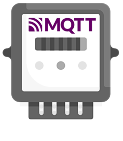

# teleinfo2mqtt

### Serial-to-MQTT Teleinfo Bridge

**teleinfo2mqtt** allows you to read Teleinfo frames from a Serial port and publish them to an Mqtt broker.

## Ready to go?
### Check out the [documentation](https://fmartinou.github.io/teleinfo2mqtt/) to get started!

## Contact & Support

- Create a [GitHub issue](https://github.com/fmartinou/teleinfo2mqtt/issues) for bug reports, feature requests, or questions
- Add a ⭐️ [star on GitHub](https://github.com/fmartinou/teleinfo2mqtt) to support the project!

## License

This project is licensed under the [MIT license](https://github.com/fmartinou/teleinfo2mqtt/blob/master/LICENSE).
