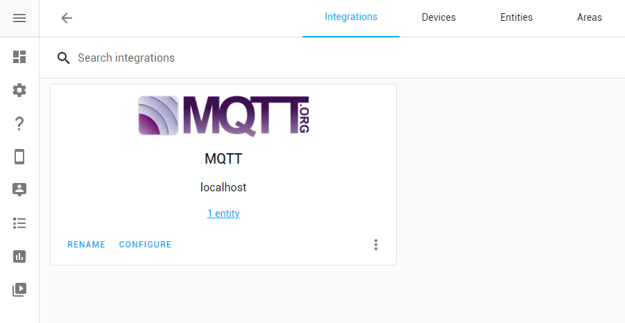

# Home Assistant integration

## Discovery
Home Assistant can automatically discover the teleinfo sensor using [MQTT Discovery](https://www.home-assistant.io/docs/mqtt/discovery/).

?> Discovery can be customized using the env var [`HASS_DISCOVERY_PREFIX`](configuration/)

### MQTT Integration view

### MQTT Entities view

## Sensor
Teleinfo sensor exposes all teleinfo data as attributes.

Teleinfo value is $PAPP (apparent power in volt-ampere). 
