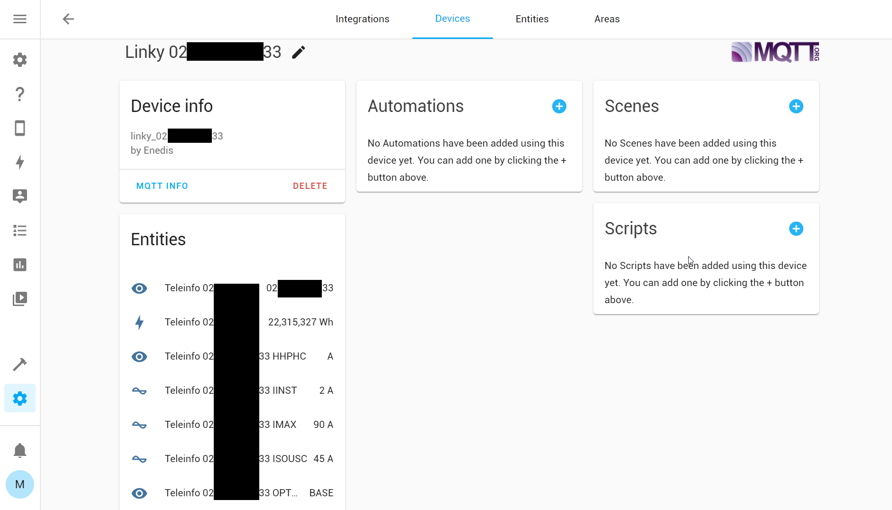
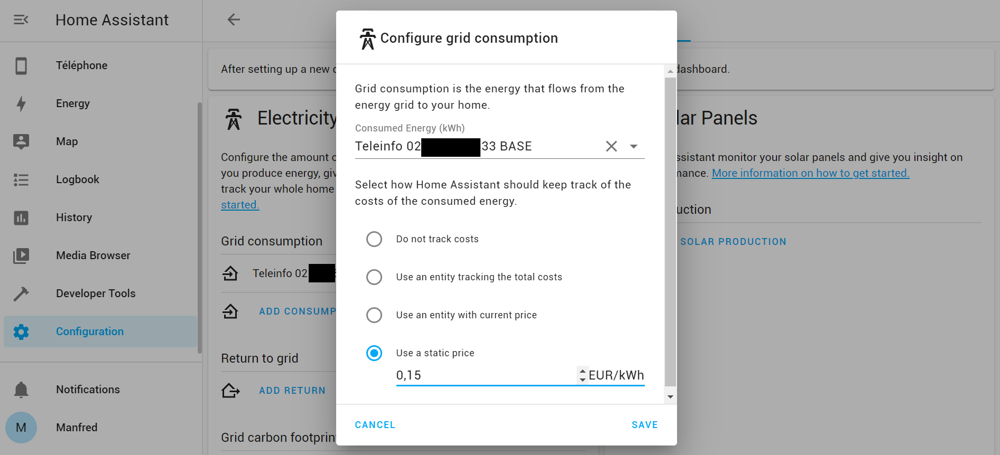
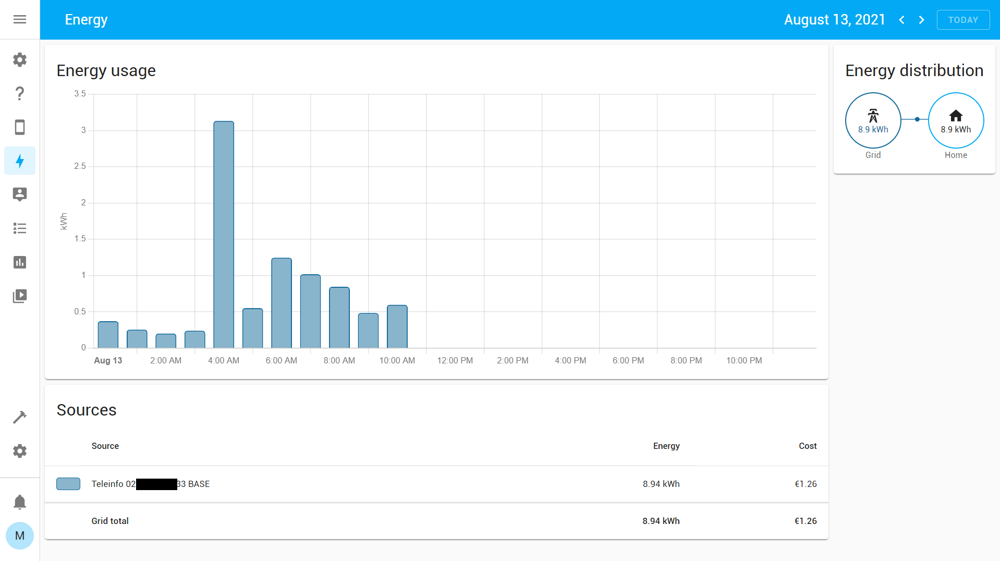

# Home Assistant integration

## Discovery

Home Assistant can automatically discover the teleinfo sensors using [MQTT Discovery](https://www.home-assistant.io/docs/mqtt/discovery/).

?> Home Assistant Discovery is enabled by default. \
You can disable it by setting [`HASS_DISCOVERY=false`](configuration/)

?> Discovery can be customized using the env var [`HASS_DISCOVERY_PREFIX`](configuration/)

### Home-Assistant Device
If you filter on `MQTT integrations`, you should see a Teleinfo entity owning multiple sensors (1 sensor per Teleinfo tag).

### Home-Assistant Energy
On the `Energy platform configuration`, you should be able to add power consumption indices (`BASE`, `HCHC`, `HCHC`...) and associate costs.

On the `Energy dashboard`, you should be able to visualize your consumption.
